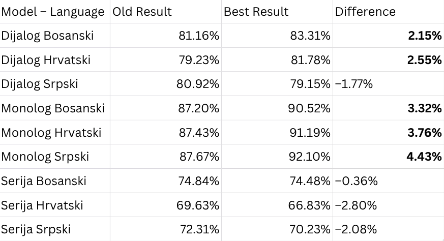

# Transcription Enhancement (LLM Post-Processing)

This directory contains an experimental workflow designed to improve the accuracy of smaller, faster Whisper models using Large Language Models (specifically ChatGPT).

## The Hypothesis

Smaller Whisper models (like `tiny` or `small`) are fast but prone to errors. Larger models are accurate but computationally expensive.
**The Goal:** Can we take the imperfect output of a **Small** model, feed it into ChatGPT with specific optimization prompts, and achieve an accuracy level comparable to larger models?

## Directory Structure

| Folder/File | Description |
| :--- | :--- |
| **`ChatGPT_Prompts/`** | Contains the different prompts used to instruct ChatGPT. Multiple prompting strategies were tested to find the most effective enhancement method. |
| **`small_model_enhanced_transcription/`** | The output text files *after* they have been processed and "fixed" by ChatGPT. |
| **`rezultati_poredjenja_DMP_final/`** | The evaluation results (HTML diffs) comparing the **Enhanced Small Model** against the original transcripts. |
| **`EnhancmentResults.png`** | A summary table visualizing the quantitative improvements in similarity percentage. |

## Methodology

1.  **Baseline:** Transcribe audio using the **Whisper Small** model and calculate its similarity to the human ground truth.
2.  **Experimentation:** The raw text is processed by ChatGPT using multiple different prompts (found in `ChatGPT_Prompts`) to see which prompting strategy works best.
3.  **Selection:** We compare the results of all prompts and select the highest performing one.
4.  **Comparison:** We measure how much the similarity percentage improved from the baseline.

## Results Visualization

The image below summarizes the success of the enhancement process.

### Understanding the Table Columns

* **Model – Language:** The specific audio file being tested (e.g., `Dijalog Bosanski`; we always use `small` model).
* **Old Result:** The baseline Similarity Percentage achieved by the raw **Whisper Small** model *before* any enhancement.
* **Best Result:** The highest Similarity Percentage achieved after testing multiple ChatGPT prompts. (e.g., If Prompt A resulted in 75% and Prompt B resulted in 80%, this column shows **80%**).
* **Difference:** The percentage point increase between the *Old Result* and the *Best Result* (The net improvement).
